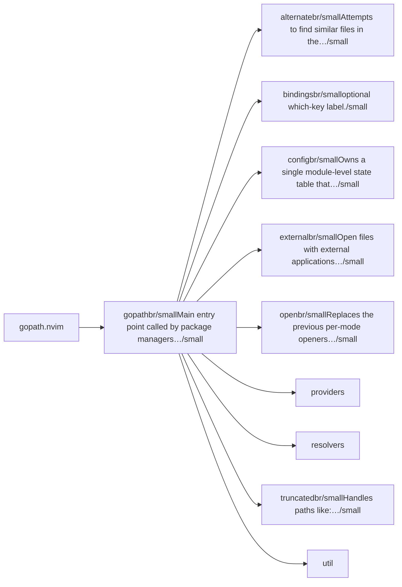
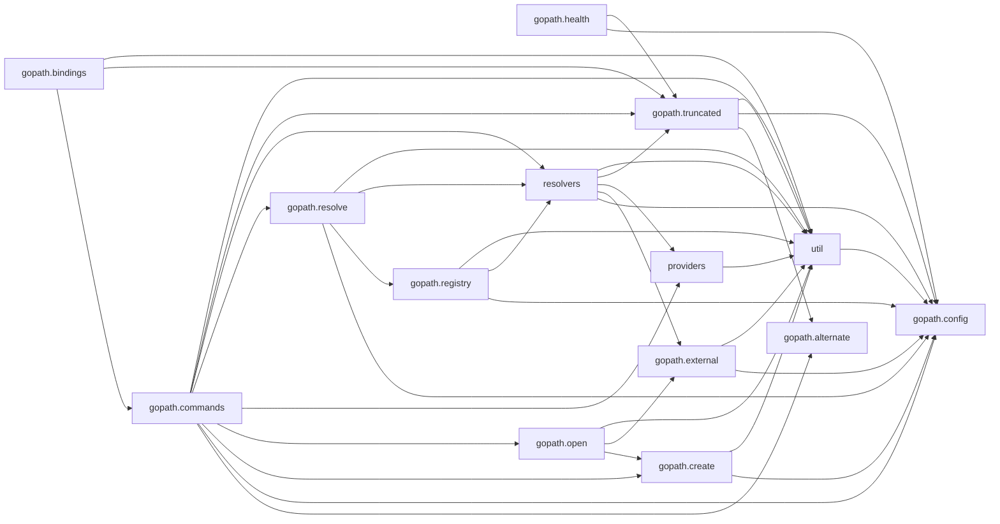

# gopath.nvim — module map

> **Generated** by `documentation`. Do not edit by hand — run `:DocMap`
> (or `nvim --headless -l scripts/gen_map.lua`) to regenerate.

**7 modules** · 17 namespaces · 56 helper files

The [interactive map](index.html) has filtering, full descriptions and
source links; this page is the version the code host renders directly.

## Namespaces

## Dependencies

Which parts of the tree require which, rolled up to the second level.
The [interactive map](index.html)'s **Deps** view has this per module,
in both directions, with load-time and lazy requires told apart.

## Modules

| Module | Description | Fns | Docs |
|---|---|---|---|
| `gopath` | Main entry point called by package managers (lazy.nvim, packer, …). | 3 | [src](../../lua/gopath/init.lua) |
| &nbsp;&nbsp;`gopath.alternate` | Attempts to find similar files in the target directory and presents them via interactive selection. | 2 | [src](../../lua/gopath/alternate/init.lua) |
| &nbsp;&nbsp;&nbsp;&nbsp;`helpers` |  |  |  |
| &nbsp;&nbsp;`gopath.bindings` | optional which-key label. | 1 | [src](../../lua/gopath/bindings/init.lua) |
| &nbsp;&nbsp;`gopath.config` | Owns a single module-level state table that is populated once by `setup()` and read-only afterwards via `get()`. | 3 | [src](../../lua/gopath/config/init.lua) |
| &nbsp;&nbsp;`gopath.external` | Open files with external applications (images, PDFs, URLs, etc.). | 2 | [src](../../lua/gopath/external/init.lua) |
| &nbsp;&nbsp;&nbsp;&nbsp;`helpers` |  |  |  |
| &nbsp;&nbsp;`gopath.open` | Replaces the previous per-mode openers (edit/window/vsplit/tab). | 2 | [src](../../lua/gopath/open/init.lua) |
| &nbsp;&nbsp;`providers` |  |  |  |
| &nbsp;&nbsp;`resolvers` |  |  |  |
| &nbsp;&nbsp;&nbsp;&nbsp;`c` |  |  |  |
| &nbsp;&nbsp;&nbsp;&nbsp;`common` |  |  |  |
| &nbsp;&nbsp;&nbsp;&nbsp;&nbsp;&nbsp;`extractor` |  |  |  |
| &nbsp;&nbsp;&nbsp;&nbsp;`csharp` |  |  |  |
| &nbsp;&nbsp;&nbsp;&nbsp;`go` |  |  |  |
| &nbsp;&nbsp;&nbsp;&nbsp;`java` |  |  |  |
| &nbsp;&nbsp;&nbsp;&nbsp;`javascript` |  |  |  |
| &nbsp;&nbsp;&nbsp;&nbsp;`lua` |  |  |  |
| &nbsp;&nbsp;&nbsp;&nbsp;`python` |  |  |  |
| &nbsp;&nbsp;&nbsp;&nbsp;`rust` |  |  |  |
| &nbsp;&nbsp;&nbsp;&nbsp;`zig` |  |  |  |
| &nbsp;&nbsp;`gopath.truncated` | Handles paths like: "...AppData\Local\nvim\init.lua:42" or "…/lua/config/init.lua". | 5 | [src](../../lua/gopath/truncated/init.lua) |
| &nbsp;&nbsp;`util` |  |  |  |

## Drift

0 errors · 0 warnings · 14 info

No errors or warnings.

14 informational findings

| Check | Message |
|---|---|
| `missing-readme` | lua/gopath has no README.md |
| `missing-readme` | lua/gopath/alternate has no README.md |
| `missing-readme` | lua/gopath/bindings has no README.md |
| `missing-readme` | lua/gopath/config has no README.md |
| `missing-readme` | lua/gopath/external has no README.md |
| `missing-readme` | lua/gopath/open has no README.md |
| `missing-readme` | lua/gopath/truncated has no README.md |
| `undocumented-param` | has_name has 2 parameter(s) but only 0 @param line(s) |
| `undocumented-param` | M.safe_notify_defer has 4 parameter(s) but only 0 @param line(s) |
| `undocumented-param` | M.safe_notify has 5 parameter(s) but only 0 @param line(s) |
| `undocumented-param` | M.safe_notify_schedule has 3 parameter(s) but only 0 @param line(s) |
| `unreferenced-module` | gopath is required by no other file in the tree |
| `unreferenced-module` | gopath.health is required by no other file in the tree |
| `unreferenced-module` | gopath.truncated is required by no other file in the tree |

